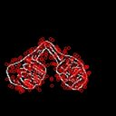

# MiniProject_ISL
### Real Time ISL prediction

### We have done this project in our 5th semester (Aug 2020- December 2020)

###  
METHODOLOGY

## 
1. Dataset Generation:

As less research has been done for the Indian Sign Language as compared to ASL proper dataset
is not available for ISL, so we have prepared our own dataset. We have built a python file
through which we can generate our data for all the Classes. So for creating a dataset we have to
use the Open Computer Vision(OpenCV) library. Firstly we captured around 7000 total images
200 for each 35 labels ISL. Then we divided the dataset in 80:20 percent ratio into training and
testing data respectively.

##### 
All Gestures
            
   &ensp; &ensp; &ensp; &ensp; &ensp; &ensp; &ensp; &ensp; &ensp; &ensp;   

## 
2.  Image Preprocessing

### Image Segmentation:

The goal of Image segmentation is to remove background and noises or we can say simplify
and/or change the representation of an image into something which is Region of Interest (ROI)
and the only useful information in the image. Image segmentation is typically used to locate
objects and boundaries (lines, curves, etc.) in images.

Two Basic Steps for image segmentation performed are:

##### 1. Skin Masking :
Using the concept of thresholding this RGB color space is converted into
grayscale image and SkinMask is finally obtained through HSV color space(which we get
from gray scale image)

##### 
 Raw Image for Letter A

 &ensp; &ensp; &ensp; &ensp; &ensp; &ensp; &ensp; &ensp; &ensp; &ensp; &ensp; &ensp; &ensp; &ensp; &ensp; &ensp; &ensp; &ensp; &ensp; &ensp; &ensp; &ensp; &ensp; &ensp; &ensp; &ensp; &ensp; &ensp; &ensp; &ensp; &ensp;   

<h1 align="center">  &#8659;</h1>

##### 
 Gray Scale Image for letter A

&ensp; &ensp; &ensp; &ensp; &ensp; &ensp; &ensp; &ensp; &ensp; &ensp; &ensp; &ensp; &ensp; &ensp; &ensp; &ensp; &ensp; &ensp; &ensp; &ensp; &ensp; &ensp; &ensp; &ensp; &ensp; &ensp; &ensp; &ensp; &ensp; &ensp; &ensp; &ensp; &ensp; &ensp; &ensp; &ensp;  

<h1 align="center">  &#8659;</h1>

##### 
 Skin Mask for letter A

&ensp; &ensp; &ensp; &ensp; &ensp; &ensp; &ensp; &ensp; &ensp; &ensp; &ensp; &ensp; &ensp; &ensp; &ensp; &ensp; &ensp; &ensp; &ensp; &ensp; &ensp; &ensp; &ensp; &ensp; &ensp; &ensp; &ensp; &ensp; &ensp; &ensp; &ensp; &ensp; &ensp; &ensp; &ensp; &ensp;     

#####  2. Canny Edge Detection:
It is basically a technique which identifies or detects the presence of
sharp discontinuities in an image there by detecting the edges of the figure in focus.

##### 
 Skin Mask for letter A 
                                        
  &ensp; &ensp; &ensp; &ensp; &ensp; &ensp; &ensp; &ensp; &ensp; &ensp; &ensp; &ensp; &ensp; &ensp; &ensp; &ensp; &ensp; &ensp; &ensp; &ensp; &ensp; &ensp; &ensp; &ensp; &ensp; &ensp; &ensp; &ensp; &ensp; &ensp; &ensp; &ensp; &ensp; &ensp; &ensp; &ensp;  

   
 <h1 align="center">  &#8659;</h1>

##### 
 Edge Detected(Canny Edge detection) Image for letter A

  &ensp; &ensp; &ensp; &ensp; &ensp; &ensp; &ensp; &ensp; &ensp; &ensp; &ensp; &ensp; &ensp; &ensp; &ensp; &ensp; &ensp; &ensp; &ensp; &ensp; &ensp; &ensp; &ensp; &ensp; &ensp; &ensp; &ensp; &ensp; &ensp; &ensp; &ensp; &ensp; &ensp; &ensp; &ensp; &ensp;  

   

## 
3. Feature Extraction:

#### 1. Feature Detection

key features of the image were extracted using SURF technique.
SURF is a feature extraction algorithm which is robust against rotation variation scaling.
We have extracted features using the inbuilt SURF function in opencv.

##### 
Image for letter A after SURF 

 &ensp; &ensp; &ensp; &ensp; &ensp; &ensp; &ensp; &ensp; &ensp; &ensp; &ensp; &ensp; &ensp; &ensp; &ensp; &ensp; &ensp; &ensp; &ensp; &ensp; &ensp; &ensp; &ensp; &ensp; &ensp; &ensp; &ensp; &ensp; &ensp; &ensp; &ensp; &ensp; &ensp; &ensp; &ensp; &ensp;     

#### 2. Clustering

To cluster all the features obtained in the above step we apply mini batch kmeans
clustering(similar to K-means clustering but efficient in terms of time
consumption and memory).

In our code we have taken k as 8 for the image of each label. So the cluster size or total
number of feature descriptors are 8 * 35. After training of all SURF features (extracted in
above step) through mini batch k-means clustering, all similar features are clustered in a
cluster. Total number of clusters are also known as visual words.
So in this step we obtained visual words for each image.

#### 3. Histogram Computation

In this step we computed Histogram using predicted visual
words(generated above) or bag of words. This is done by calculating the frequency of each visual word
belonging to the image in total visual words.

## 
4. Building SVM Model for Classification

Once all the histograms are generated for the total data set using the above step, the training
dataset is trained using **Support Vector Machine Classifier** and then predicted with a linear
kernel. Other Classifiers like CNN, KNN, Logistic Regression can also be used for classification.

Additionally for the purpose of real time recognition the trained model is saved in a file so that a
user can predict the gesture using video feed in real time.

