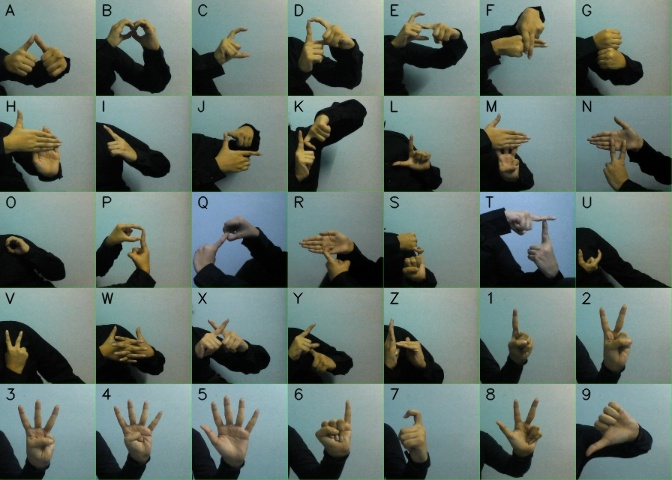
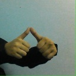
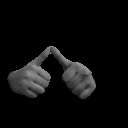
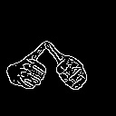

# MiniProject_ISL
### Real Time ISL prediction

### We have done this project in our 5th semester (Aug 2020- December 2020)

###  
METHODOLOGY

## 
1. Dataset Generation:

  
As less research has been done for the Indian Sign Language as compared to ASL proper dataset
is not available for ISL, so we have prepared our own dataset. We have built a python file
through which we can generate our data for all the Classes. So for creating a dataset we have to
use the Open Computer Vision(OpenCV) library. Firstly we captured around 7000 total images
200 for each 35 labels ISL. Then we divided the dataset in 80:20 percent ratio into training and
testing data respectively.

##### 
All Gestures
            
   &ensp; &ensp; &ensp; &ensp; &ensp; &ensp; &ensp; &ensp; &ensp; &ensp; &ensp; &ensp; &ensp;  

### 
2.  Image Preprocessing

### Image Segmentation:

The goal of Image segmentation is to remove background and noises or we can say simplify
and/or change the representation of an image into something which is Region of Interest (ROI)
and the only useful information in the image. Image segmentation is typically used to locate
objects and boundaries (lines, curves, etc.) in images.

Two Basic Steps for image segmentation performed are:

##### 
1. Skin Masking :

Using the concept of thresholding this RGB color space is converted into
grayscale image and SkinMask is finally obtained through HSV color space(which we get
from gray scale image)

##### 
 Raw Image for Letter A

   &ensp; &ensp; &ensp; &ensp; &ensp; &ensp; &ensp; &ensp; &ensp; &ensp; &ensp; &ensp; &ensp;  
	 
<h1 align="center">  &#8659;</h1>

##### 
 Gray Scale Image for letter A

   &ensp; &ensp; &ensp; &ensp; &ensp; &ensp; &ensp; &ensp; &ensp; &ensp; &ensp; &ensp; &ensp;  
	 
<h1 align="center">  &#8659;</h1>

##### 
 Skin Mask for letter A

   &ensp; &ensp; &ensp; &ensp; &ensp; &ensp; &ensp; &ensp; &ensp; &ensp; &ensp; &ensp; &ensp;  
	 
<h1 align="center"> &#8659;</h1>

#####  2. Canny Edge Detection:
It is basically a technique which identifies or detects the presence of
sharp discontinuities in an image there by detecting the edges of the figure in focus.

##### &ensp; &ensp; &ensp; &ensp; &ensp; &ensp; &ensp; &ensp;  &ensp; &ensp; &ensp; &ensp; &ensp; &ensp; Skin Mask for letter A                                         
   &ensp; &ensp; &ensp; &ensp; &ensp; &ensp; &ensp; &ensp; &ensp; &ensp; &ensp; &ensp; &ensp;  	
   
 <h1 align="center">  &#8659;</h1>

##### &ensp; &ensp; &ensp; &ensp; &ensp; &ensp; &ensp; &ensp;  &ensp; &ensp; Edge Detected(Canny Edge detection) Image for letter A
   &ensp; &ensp; &ensp; &ensp; &ensp; &ensp; &ensp; &ensp; &ensp; &ensp; &ensp; &ensp; &ensp; 
   

### Feature Extraction:

#### 1. Feature Detection

key features of the image were extracted using SURF technique.
SURF is a feature extraction algorithm which is robust against rotation variation scaling.
We have extracted features using the inbuilt SURF function in opencv.

